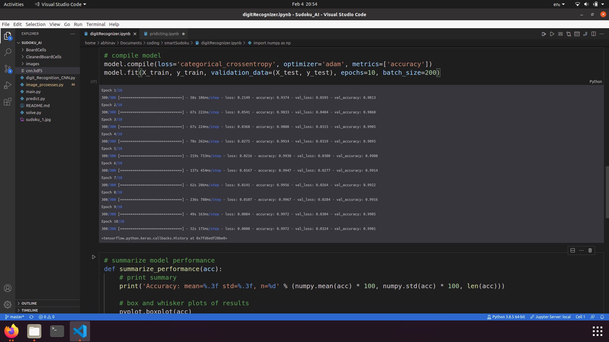
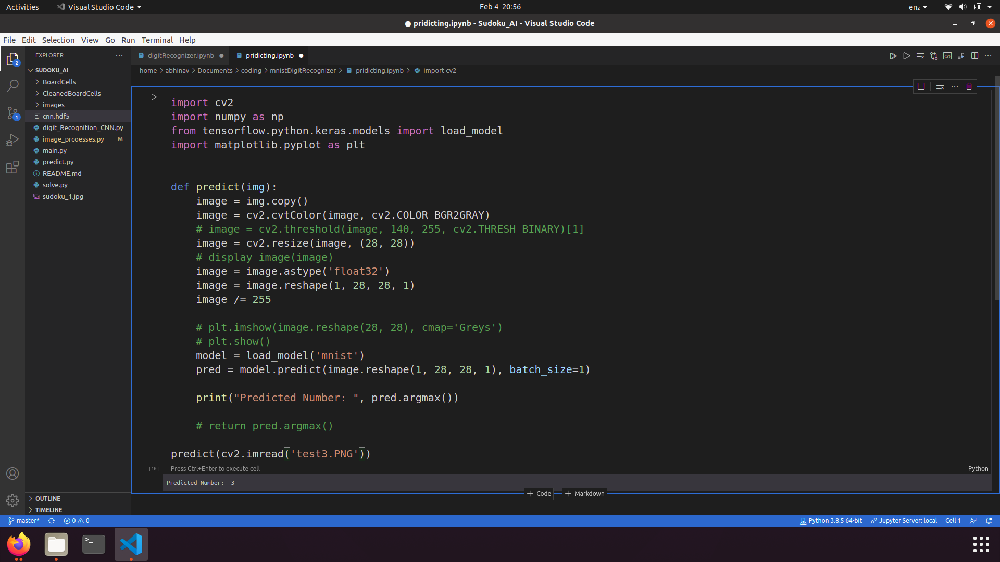

# MNIST Digit-Recognition
An implementation of multilayer neural network using keras with an Accuracy: mean=98.960 std=0.097, n=5 using 5-crossfold Validation and using the built-in evaluation of 99.13
## About MNIST dataset:
MNIST (Modified National Institute of Standards and Technology database) is probably one of the most popular datasets among machine learning and deep learning enthusiasts. The MNIST dataset contains 60,000 small square 28×28 pixel grayscale training images of handwritten digits from 0 to 9 and 10,000 images for testing. So, the MNIST dataset has 10 different classes. 
## Steps:
* Import the libraries and load the dataset: Importing the necessary libraries, packages and MNIST dataset
* Preprocess the data
* Create the model
* Train and Evaluate the Model
* Saving the model
* Make Predictions

## Accuracy:
Accuracy using 5-crossfold Validation is mean=98.960 std=0.097, n=5 and using the built-in evaluation of 99.00

## Pridicting Function
This function pridicts the image which is porvided to it and prints that particular number.

# Resources
* [Deep Learning Introduction](https://www.forbes.com/sites/bernardmarr/2018/10/01/what-is-deep-learning-ai-a-simple-guide-with-8-practical-examples/?sh=65924bff8d4b)
* [Data Normalizing](https://medium.com/@urvashilluniya/why-data-normalization-is-necessary-for-machine-learning-models-681b65a05029)
* [CNN layers](https://www.tensorflow.org/api_docs/python/tf/keras/layers/Layer)

